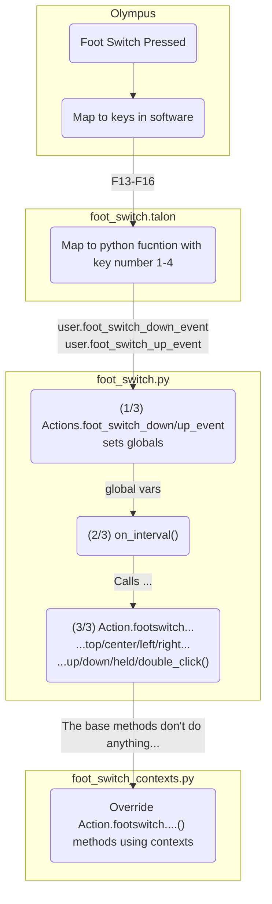

# My Version

## Note
Map either:
- Held & Double-Click
- Pressed
> If you combine them, pressed will also be triggered on each held/double-click

## Logic





# On Linux, keys require using xmodmap to map the keys

```bash
Xmodmap ~/.Xmodmap
```

```
# ~/.Xmodmap
keycode 191 = F13 F13 F13
keycode 192 = F14 F14 F14
keycode 193 = F15 F15 F15
keycode 194 = F16 F16 F16
keycode 195 = F17 F17 F17
keycode 196 = F18 F18 F18
keycode 197 = F19 F19 F19
keycode 198 = F20 F20 F20
keycode 199 = F21 F21 F21
keycode 200 = F22 F22 F22
keycode 201 = F23 F23 F23
keycode 202 = F24 F24 F24

keycode 203 = F25 F25 F25
keycode 204 = F26 F26 F26
keycode 205 = F27 F27 F27
keycode 206 = F28 F28 F28
keycode 207 = F29 F29 F29
keycode 208 = F30 F30 F30
keycode 209 = F31 F31 F31
keycode 210 = F32 F32 F32
keycode 211 = F33 F33 F33
keycode 212 = F34 F34 F34
keycode 213 = F35 F35 F35
```

# [SOURCE](https://github.com/AndreasArvidsson/andreas-talon/tree/master/core/foot_switch) Foot switch integration

## Hardware

[Olympus RS31H](https://www.amazon.com/Olympus-RS31H-Professional-Dictation-Connection/dp/B01C3FSPQK)

## Installation

1. Download [Foot Switch Configuration Tool](https://dl-support.olympus-imaging.com/odms_download/ftsw_configuration_tool/en/)
1. Open foot switch configuration tool
1. Change operating mode to: `Keyboard mode`
    - The above step can be achieved by importing [olympus_rs31h.xml](./olympus_rs31h.xml)
1. Change shortcut keys to: F13, F14, F15, F16
    - The above step can be achieved by importing [olympus_rs31h.xml](./olympus_rs31h.xml)
    - On Windows F-keys above F12 won't be visible in the tool, but works if imported
      
1. Add [foot_switch.talon](./foot_switch.talon) and [foot_switch.py](./foot_switch.py) to your Talon user directory
1. My mouse scroll actions are not Knausj default. To utilize my implementation of mouse scroll with the foot switch you will need [mouse_scroll.py](../mouse/mouse_scroll.py)

